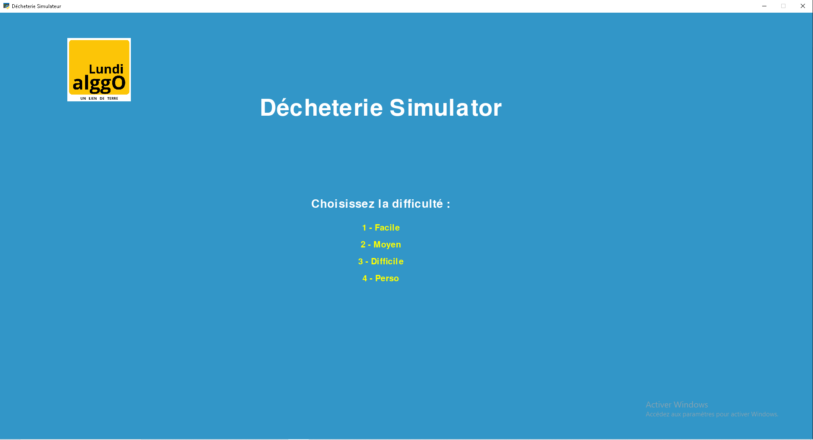
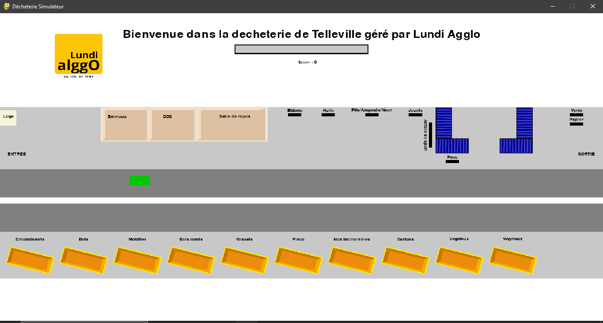
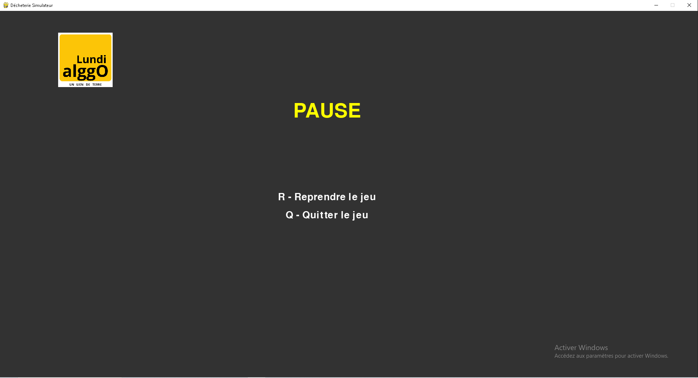
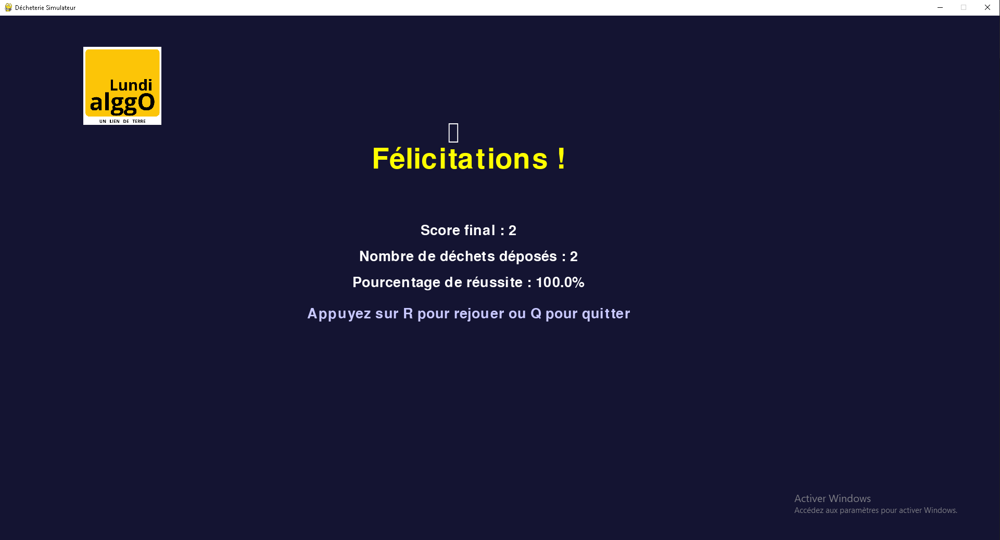

## Décheterie Simulators
<p align="center">
  
  <br><br>
  
  
</p>

DéchetSimulators est un jeu/simulation interactif développé en Python avec Pygame. Il permet de visualiser une déchetterie, d’interagir avec des bennes, des conteneurs et des bâtiments, et de simuler l’arrivée d’une voiture avec affichage de bulles d’informations sur les déchets.

---
## Fonctionnalités
- Affichage d’une déchetterie avec bennes colorées pour différents types de déchets.
- Conteneurs noirs et bâtiments cliquables (Emmaüs, DDS, etc.).
- Affichage d’une voiture entrant dans la déchetterie.
- Bulles d’informations affichées lorsque la voiture s’arrête.
- Les textes dans la bulle peuvent être sélectionnés et déplacés (drag & drop) individuellement.
- Interface simple et visuelle pour identifier les types de déchets et leur emplacement.
- Système de score dynamique et coloré selon la réussite.
- Menu de pause et écran de fin intégrés.
---
## 🛠 Installation

1. Assurez-vous d’avoir **Python 3.11+** installé sur votre machine.  
2. Installez **Pygame** si ce n’est pas déjà fait :  

```bash
pip install pygame
```
---
## Fonctionnement du jeu

Vous incarnez un joueur qui découvre la nouvelle déchetterie de Telleville, gérée par Lundi Agglo. Votre objectif est d’aider les visiteurs à trier correctement leurs déchets. Pour cela :

- Vous devrez vider les voitures des visiteurs.
- Placer les déchets dans les bonnes bennes rapporte des points.
- Se tromper vous fait perdre des points.
---
## Page de démarrage

Au lancement du jeu, vous pouvez choisir parmi 4 modes de difficulté :

- Facile
- Moyen
- Difficile
- Personnalisé

Pour les trois premiers modes, le score maximum est prédéfini.
Le mode personnalisé vous permet de choisir vous-même le score maximum que vous souhaitez atteindre.
---
## Page de pause

Vous pouvez mettre le jeu en pause à tout moment en appuyant sur la touche P.

Deux options s’offrent alors à vous :

- R : Reprendre la partie.
- Q : Quitter le jeu.
---
## Page de fin

Lorsque vous atteignez le score maximum, le jeu affiche la page de fin.

Selon votre score final, vous êtes classé dans ce tableau :

- 0 à 24 % : Commencez par trier chez vous avant d’aider les autres.
- 25 à 49 % : Votre tri chez vous est correct, mais manque de rigueur.
- 50 à 74 % : Très bon gardien de déchetterie.
- 75 à 99 % : Excellent niveau de tri, vous pourriez travailler dans une déchetterie.
- 100 % : Prodige du tri ! Vous montrez l’exemple à vos collègues sur le terrain. On vous considère parmi les plus grand dans le tri.
---

## Astuces
1. Des agents de la déchetterie se trouvent dans la salle de repos.
    Vous pouvez les solliciter si vous ne savez pas où jeter un déchet (1 aide par objet et par voiture).
2. Code couleur des déchets :
- Vert : Déchet correctement placé.
- Bleu : Aide fournie par un agent.
- Rouge : Déchet mal placé.
